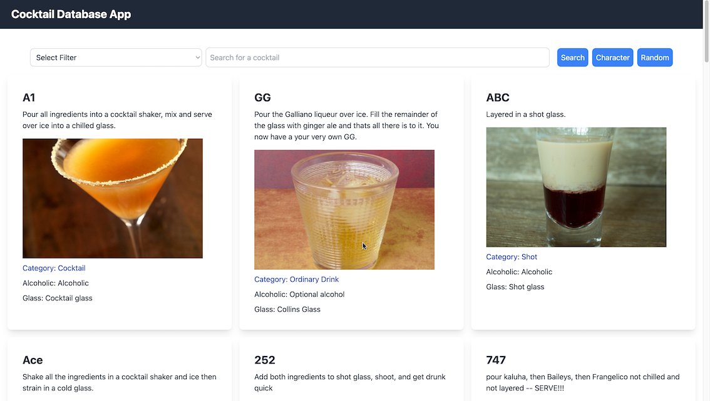
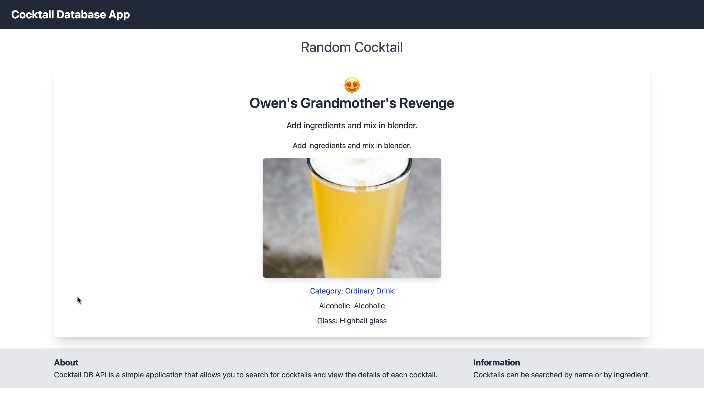

# Cocktails DB in Svelte

[](https://svelte.dev/)
[](https://tailwindcss.com/)
[](https://www.docker.com/)
[](https://nginx.org/)
[](https://vitejs.dev/)

I had just completed a course on Svelte and wanted to create a basic app to test things I learned. This app is pretty much the result of it. It uses this popular API which gets all the cocktails around the world. You can filter it based on category, class, is alcoholic or not and more.

## Features

- Contains Homepage, a nested page to get random cocktail of the day, Cocktails page and a list page which has list of glass, categories and ingredients.

- Can filter by first letter of the cocktail and ingredients. More filters can be added in future

## Deployment

Inside the project you can find Dockerfile and Nginx conf file for deploying this application on any VPS using Docker. The build folder can also be directly deployed on websites like Vercel. Please follow the following steps to deploy on VPS using Docker.

1. Build the image from the given Dockerfile, give it a intuitive name 'anime-dashboard'.

```
docker build -t svelte-cocktail . 
```

2. Run the Docker container on port 4200 which is the default port used by Angular Applications.

```
docker run -p 4200:80 --name cocktail svelte-cocktail
```

## Notes

I had fun while creating this app, might as well become my favorite JS framework at least for the time being. Looking forward to create more projects using it as well as giving SvelteKit a try. 😄

## Screenshots

This is the main cocktails page of the application where you can search by first letter and by name.



If you click on random you'd be directed to the random cocktails page which would hit API end-point to get the random cocktails of the day.



